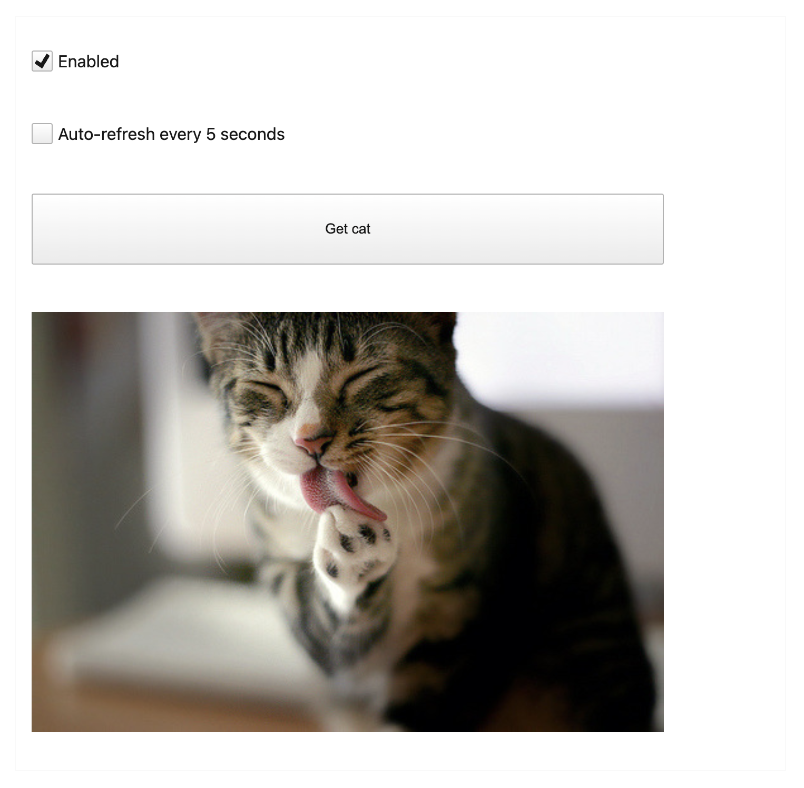

# Генератор случайных котиков

Получение случайных котиков по API.

.

## Функционал

Можно получить случайную картинку с котом двумя способами:

- выбрав "Enabled", тем самым разблокируется кнопка "Get cat". Кликом на кнопку получаем кота;
- выбрав "Auto-refresh after 5 seconds". Таким образом картинку будут появляться новые через каждые 5 секунд.
